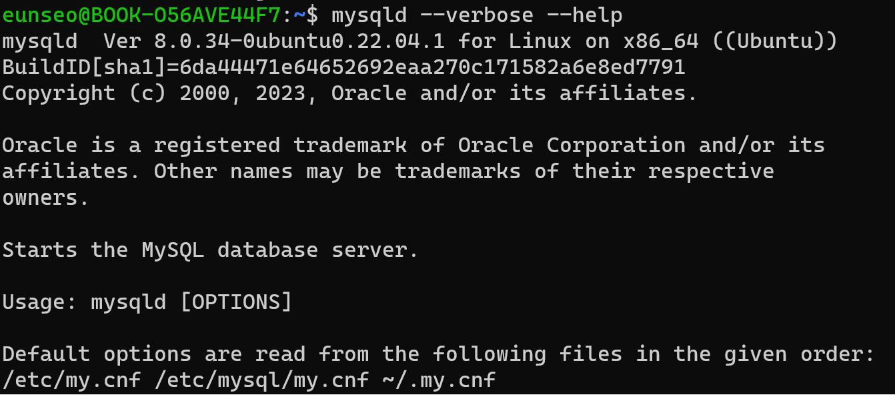
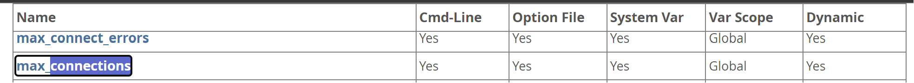
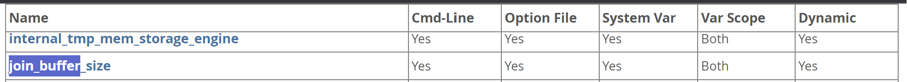
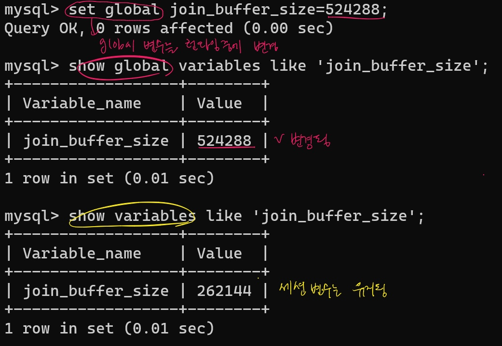
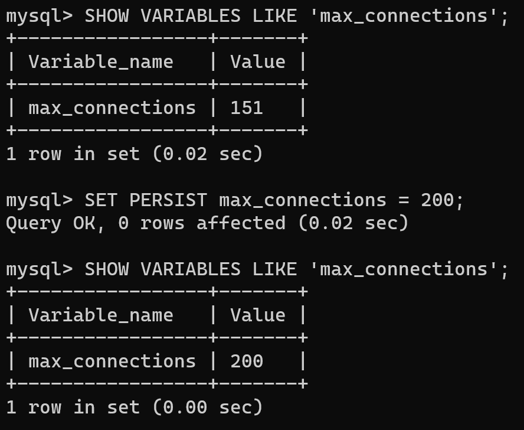

# MySQL의 설정 파일
* MySQL 서버는 단 하나의 <u>설정 파일</u>을 사용
* 리눅스를 포함한 유닉스 계열에서는 <u>my.cnf</u>, 윈도우에서는 myini
* MySQL 서버가 어느 디렉토리에서 설정 파일을 읽는지 궁금하다면

default 아래부터 우선순위가 높은 순서로 (= 어느 디렉토리의 my.cnf 파일을 읽는지) 확인 가능

# MySQL 시스템 변수 특징
> ✍️ **시스템 변수**  
> 데이터베이스 서버의 <u>행동을 조정하는</u> 설정 값들 
> [ex] max_connections (최대 연결 수) - 동시에 데이터베이스에 연결할 수 있는 클라이언트 수를 몇으로 설정할까?

MySQL 서버는 가동하면서 설정 파일의 내용을 읽어 메모리나 작동 방식을 초기화하고, 접속된 사용자를 제어하기 위하여 값을 별도로 저장해두는데 이 값을 **시스템 변수** 라고 함

## 글로벌 변수와 세션 변수 (분류 기준 : 적용 범위)
<u>적용 범위에 따라</u> 변수를 글로벌 변수와 세션 변수로 나눌 수 있다.
1. 글로벌 변수
* 하나의 MySQL 서버 인스턴스에서 **전체적으로** 영향을 미치는 시스템 변수 * (서버 전체에 공유됨)
* 대체로 MySQL 서버 자체에 관련된 설정

2. 세션 변수
* 개별 클라이언트 세션에만 영향을 미치는 설정
* 세션 범위의 시스템 변수는 MySQL 서버의 설정 파일(my.cnf)에 초기값을 명시할 수 없고, 커넥션이 만들어지는 순간 해당 커넥션에만 적용됨

## 정적 변수와 동적 변수 (분류 기준 : 서버 실행중에 값이 변경 가능한지)
MySQL 서버가 <u>실행중인 상태에서 변경이 가능한지 여부에 따라</u> 동적 변수와 정적 변수로 구분됨

기본적으로 MySQL의 많은 변수는 정적 변수로 설정됨. (= 서버를 다시 시작해야 변경 가능) 일부 변수는 동적 변수로 설정되어 있어 런타임 중에 변경 가능

1. 정적 변수
* MySQL 설정 파일 (my.cnf 또는 my.ini)에서 설정되며, 이 파일을 수정한 후에 MySQL 서버를 **다시 시작**해야 변경한 내용이 적용됨

2. 동적 변수
* MySQL 서버를 **재시작하지 않고도** 변경할 수 있는 변수
* 변경한 내용이 즉시 적용됨

## MySQL 서버의 시스템 변수를 변경하는 방법은?
1. 설정 파일 (my.cnf 또는 my.ini)를 변경한다.
2. 실행중인 MySQL 서버 메모리에 있는 MySQL 서버의 시스템 변수를 변경한다.
> SHOW를 통해 적용된 변수 값을 확인, SET을 통해 값을 변경
> SET 명령을 통해 변경한 시스템 변수는 현재 실행중인 MySQL 에서만 유효하여, 시스템 변수를 영구적으로 적용하려면 설정파일도 변경을 해줘야 함

## 예시1- max connections

* <u>**글로벌변수**</u> vs 세션변수
* 정적변수 vs <u>**동적변수**</u>

글로벌변수이면서 동적 변수이므로 <u>런타임 중에 변경이 가능함</u> 

cf. 일반적으로 글로벌 시스템 변수는 MySQL 서버 실행중에는 변경할 수 없는게 많음. my.cnf 설정 파일에 기록이 안 되어서 재시작하는 경우가 있음

## 예시2- join_buffer_size와 

* <u>**글로벌변수**</u> vs <u>**세션변수**</u>
* 정적변수 vs <u>**동적변수**</u>
> ✏️ 메모  
> 동적 변수이면서 시스템 변수 범위가 BOTH인 경우, SET 명령을 통해 변수를 변경했을 때 글로벌 시스템 변수의 값은 변경이 되어도, 이미 존재하는 커넥션의 세션 변수값은 그대로 유지가 됨

2. 글로벌 변수와 세션 변수 변경

> 그래서 MySQL 8.0 부터는 **SET PERSIST**를 이용하여, 실행중인 MySQL 서버의 시스템 변수를 변경함과 동시에 자동으로 설정파일로도 기록이 됨

# SET PERSIST와 SET PERSIST ONLY
## SET PERSIST
MySQL 서버는 변경한 값을 즉시 적용함과 동시에 my.cnf 파일이 아니라 **별도의 설정파일(mysqld-auto.cnf)에 변경 내용을 기록함**

그래서 서버를 재시작할 때 별도의 설정파일(mysqld-auto.cnf)을 my.cnf 설정 파일과 함께 참조하여 시스템 변수를 적용함

 **MySQL 서버를 다시 시작하지 않고도 영구적으로 설정 변경**을 할 수 있도록

## SET PERSIST_ONLY
* 변경된 변수의 값이 바로 적용되지는 않음.
* 재시작할 때 mysqld-auto.cnf 파일에 정적인 변수의 값이 변경되어 기록됨.

## 예시 - SET PERSIST 
1. max-connections 설정값 151에서 설정값 200으로 변경하고, 변경 내용이 데이터베이스 설정 파일에도 저장됨

2. 다시 재시작했을 때 max-connections값이 200으로 변경됨

## 예시 - SET PERSIST ONLY
현재 실행중인 서버에는 변경 사항이 적용 안됨

