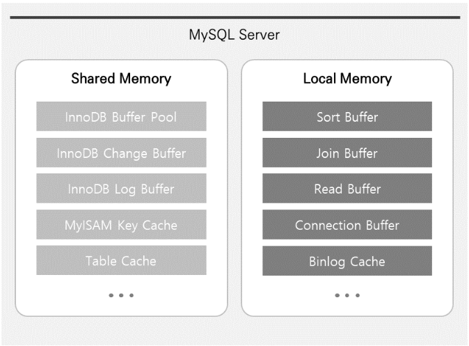

# 메모리 구조

## Global Memory
 1. InnoDB : Buffer Pool
 - InnoDB 스토리지 엔진의 가장 큰 메모리 영역인 Buffer Pool에는 Data, 인덱스, Lock, Data Dictionary 및 기타 정보를 저장. (Oracle의 Buffer Cache 영역과 유사)
 - 주로 자주 사용되는 Data를 메모리 영역에 캐싱해서 빠르게 접근하기 위한 용도로 사용

2. InnoDB : Change Buffer(구 버전 - Insert Buffer)
- Insert, Update, Delete와 같은 Data 변경 작업 시 사용되는 메모리 영역
- Data 변경 작업 시 인덱스에도 변경 내역이 반영되어야 하는데, 관련 인덱스가 많다면 자원 소모가 커질 수 있습니다. 이러한 이유로 인덱스에 대한 작업 성능 향상을 목적으로 하는 메모리 공간이 바로 Change Buffer
- MySQL 5.5 이전에는 Insert 작업에 대한 변경내역만을 기록하였기 때문에 Insert Buffer라고도 함.

3. InnoDB : Adaptive Hash Index
- B-Tree Index의 약점을 보완하기 위한 InnoDB의 기능으로, 자주 사용되는 컬럼을 해시로 정의하여 바로 Data에 접근이 가능하게 하는 기능
  이때, 모든 값이 아닌 자주 사용되는 Data 값만 해시 값으로 생성. (Adaptive Hash Index 영역에 할당되며 전체 Innodb Buffer Pool의 1/64 만큼으로 초기화됨)

4. MyISAM : Key Cache
- MyISAM의 Key Cache는 InnoDB의 Buffer Pool과 유사한 역할을 하는 메모리 영역으로, MyISAM 테이블의 인덱스를 캐싱하기 위한 공간. 
  (MyISAM 스토리지 엔진에서 Index Block은 Key Cache라는 특수 영역에 캐싱되지만, Data Block의 경우에는 특별한 캐싱 영역이 없으며, 대신 운영체제에서 제공하는 파일 시스템 캐시를 사용)
- Key Cache는 여러 Session에서 동시에 Access 할 수 있으며, 여러 개 설정하거나 특정 캐시에 인덱스를 할당할 수 있음
- Key Cache의 크기는 key_buffer_size System Variable로 설정 가능하며, 0으로 설정 시 Key Cache를 사용하지 않음. Key Cache를 사용하지 않으면 운영체제에서 제공하는 OS Cache만 사용하여 인덱스 파일에 Access
- MyISAM 테이블의 인덱스는 Key Cache를 이용하여 디스크 I/O 없이 빠르게 검색할 수 있지만, 테이블 Access에 대한 디스크 I/O는 발생. 즉, MyISAM 테이블에 대한 Read/Write 작업은 항상 물리적인 I/O를 수반

5. 공통 : Query Cache
 (Query Cache는 MySQL 4.0.1에서 도입된 후 MySQL 5.7.20부터 더 이상 사용되지 않으며 MySQL 8.0에서 완전히 제거됨)
- Query Cache에는 Client로 전송된 결과 집합과 Select 문장을 함께 저장
- 동일한 Query가 수행되면 MySQL Server는 해당 Query에 대한 Parsing 과정을 수행하는 대신 Query Cache에서 결과를 검색
- Query Cache는 자주 변경되지 않는 테이블에 대해 동일한 Query를 자주 사용하는 환경에서 유용. 
  하지만 테이블이 변경되면 결과값에 대한 보장을 할 수 없으므로 Query Cache에서 관련 항목이 제거.
  (테이블 변경으로 인한 Query Cache 제거 과정에서 유효하지 않은 Data를 가져가지 못하도록 Lock을 걸며, Lock이 해소될 때까지 Query Cache에 Access 하는 모든 Thread는 대기상태에 빠짐.
 이러한 이유로, 테이블에 대한 변경이 잦고 Query Cache를 사용하는 Select Query가 많을수록 심각한 속도가 느려짐)

6. 공통 : Table Cache
- MySQL에서 테이블을 읽고 쓰기 위해서는 항상 테이블을 열고 사용 후에는 닫아야 하는데, 이러한 작업은 부하를 발생시키기 때문에 오픈된 테이블의 정보를 특정 공간(Table Cache)에 담아둠.
- 동일한 정보(테이블)에 대한 Thread 간 공유는 불가능하므로, 동일 테이블에 접근하는 Thread가 많을수록 정보를 저장하기 위한 추가 메모리 공간을 필요
- MySQL은 다중 Thread로 동작하므로 동일 테이블에 대해 동시에 Query를 수행하는 많은 Client가 있을 수 있지만, 동일 테이블에 대해서는 Thread 간 공유되지 못함.
  (동일 테이블에 접근하는 Thread가 많을수록 더 많은 테이블이 오픈되어야 하므로 추가 메모리를 사용)

## Local Memory
1. Sort Buffer
2. Join Buffer
3. Read Buffer
- 일반적으로 MyISAM 테이블에 대한 Sequential Scan(Full Table)을 수행해야 할 때, 각 테이블에 대해 Read Buffer를 할당.
  또한 MyISAM 엔진뿐만 아니라 기타 다른 엔진에서도 Read Buffer를 할당하여 사용
- 모든 스토리지 엔진에서 Read Buffer가 사용되는 경우
  1. ORDER BY로 Row를 정렬할 때, 인덱스를 Temp File(Not Temp Table)에 캐시 하는 경우
  2. 파티션에 대량 Insert 하는 경우
  3. Nested Query의 결과를 캐싱하는 경우

4. Connection Buffer & Result Buffer
- Server는 Client Connection 요청에 대해 Thread를 생성하여 사용하는데, 이때 각 Thread에는 Connection Buffer와 Result Buffer라는 공간이 필요

5. Binlog Cache
- Binary Log는 Replication 구성 또는 시점 복구 등에 사용하기 위한 로그이며, 테이블 생성 작업 또는 Data 변경과 같은 DB 변경사항 등 변화된 이벤트를 바이너리 방식으로 기록. 
  (Oracle의 Flashback 기능을 Binlog 기반으로 유사하게 구현 가능)
