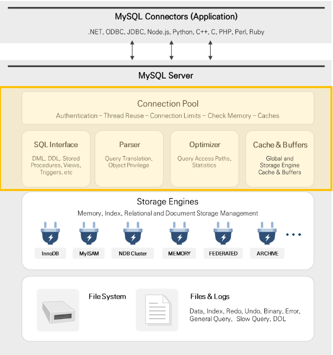

# MYSQL 엔진 구조

##Connection Pool Layer
 Connection Pool은 MySQL Architecutre의 최상위 계층으로 Client의 Connection을 생성 및 관리하며 요청 Query를 처리

 연결 처리
  MySQL Server는 Client의 Connection 요청에 대해 Thread를 할당합니다. Client는 할당받은 Thread에서 Query를 수행
  (Thread는 Server에 의해 캐시 되므로 새로운 Connection에 대하여 항상 생성할 필요는 없음)
 인증
  MySQL Server는 Client가 연결될 때마다 Client의 호스트, 사용자 이름, 패스워드 등을 기반으로 인증을 수행
 보안
  MySQL Server에 Client가 성공적으로 연결되면 Server는 해당 Client가 특정 Query를 수행할 권한이 있는지 확인
 
##SQL Interface
 MySQL은 Command를 수신하고 Client에게 결과를 전송하는 Interface로 ANSI SQL 표준을 준수하며, 대부분의 ANSI 호환 Database Server의 SQL을 Interface로 사용
 SQL Interface 구성요소는 DML, DDL, Stored Procedures, Views, Triggers 등이 있음

##Parser
 사용자 요청 Query를 토큰(MySQL이 인식할 수 있는 최소 단위의 어휘나 기호)으로 분리, Tree 형태의 구조로 만들어 내는 작업을 의미, 이 과정에서 Query의 문법 오류 발견 시 사용자에게 오류 메시지를 전달

##Optimizer
 사용자의 요청 Query를 얼마나 낮은 비용으로 효율적으로 처리할지를 결정하는 역할을 수행. Query 재작성, 스캔 순서 조정 및 인덱스의 선택과 같은 작업을 수행

##Cache & Buffers
 Data 및 인덱스에 대해 빠르게 Read/Write 하기 위한 목적으로 사용되는 메모리 공간. (MyISAM의 Key Cache나 InnoDB의 Buffer Pool과 같은 보조 저장소)

# Thread 구조

##Foreground Thread(Client Thread)
  Foreground Thread의 수는 최소 MySQL Server에 접속한 Client 수만큼 존재하며, 각 Client 사용자가 요청한 Query를 처리
 사용자가 작업을 마치고 Session이 종료되면 해당 Thread는 Thread Cache로 반환됩니다. 이때 Thread Cache에 일정 개수 이상의 대기 중인 Thread가 있다면 해당 Thread를 종료시켜 일정 개수의 Thread만 Thread Cache에 유지
 Thread Cache에 유지할 수 있는 최대 Thread 개수는 thread_cache_size라는 System Variable로 설정
 일반적인 Foreground Thread는 사용자 요청(Query)을 받아 필요한 Data를 가져오는 역할을 수행하는데, 사용 중인 스토리지 엔진에 따라 역할 및 수행 범위가 달라질 수 있음
 예를 들어, MyISAM 테이블의 경우 디스크 I/O관련 작업은 모두 Foreground Thread가 담당하지만, InnoDB 테이블은 메모리에 대한 Read/Write 작업만을 Foreground Thread가 담당
 (이외의 작업은 Background Thread가 담당)

##Background Thread
  다양한 MySQL의 스토리지 엔진 중 InnoDB의 경우 많은 작업을 Background Thread가 수행
 Data 읽기 작업의 경우, 주로 Foreground Thread가 처리하기 때문에 Read Thread를 많이 설정할 필요는 없지만, 쓰기 작업의 경우 대부분의 작업을 Background Thread가 담당하므로 충분한 수의 Write Thread를 설정하는 것이 좋음
 과거 버전에서는 Master Thread가 여러 가지 역할을 수행했기 때문에 동시성이 떨어졌지만, 지금은 각각의 작업들이 역할별로 분리되어 각기 다른 Thread들이 담당. 
 예를 들어, Buffer Pool에 있는 Dirty Page를 Flush 하는 일은 Page Cleaner Thread가 수행하며 있으며, Delete Query에 의해서 삭제 처리된 Row를 물리적으로 삭제하는 일은 Purge Thread가 수행.

InnoDB 엔진의 주요 Background Thread
Master Thread	-  Background Thread의 관리 및 다양한 작업들의 스케줄링을 담당
                 Data 일관성을 보장하기 위해 Buffer Pool의 Data를 디스크로 비동기식으로 Flush
Insert Buffer -	Insert Buffer(Change Buffer)를 Merge
Log Thread	-	트랜잭션 로그(Redo Log)를 작성
Read Thread	-	다양한 유형의 Read 요청 처리
Write Thread	-	다양한 유형의 Write 요청 처리
Page Cleaner - Pool의 Dirty Page를 디스크로 Flush
Purge Thread	-	Rollback에 더이상 필요하지 않은 Row를 제거하는 작업을 담당

# 메모리 구조

##Global Memory
 -InnoDB : Buffer Pool
 InnoDB 스토리지 엔진의 가장 큰 메모리 영역인 Buffer Pool에는 Data, 인덱스, Lock, Data Dictionary 및 기타 정보를 저장. (Oracle의 Buffer Cache 영역과 유사)
 주로 자주 사용되는 Data를 메모리 영역에 캐싱해서 빠르게 접근하기 위한 용도로 사용

-InnoDB : Change Buffer(구 버전 - Insert Buffer)
Insert, Update, Delete와 같은 Data 변경 작업 시 사용되는 메모리 영역
Data 변경 작업 시 인덱스에도 변경 내역이 반영되어야 하는데, 관련 인덱스가 많다면 자원 소모가 커질 수 있습니다. 이러한 이유로 인덱스에 대한 작업 성능 향상을 목적으로 하는 메모리 공간이 바로 Change Buffer
MySQL 5.5 이전에는 Insert 작업에 대한 변경내역만을 기록하였기 때문에 Insert Buffer라고도 함.

-InnoDB : Adaptive Hash Index
B-Tree Index의 약점을 보완하기 위한 InnoDB의 기능으로, 자주 사용되는 컬럼을 해시로 정의하여 바로 Data에 접근이 가능하게 하는 기능
이때, 모든 값이 아닌 자주 사용되는 Data 값만 해시 값으로 생성. (Adaptive Hash Index 영역에 할당되며 전체 Innodb Buffer Pool의 1/64 만큼으로 초기화됨)

-MyISAM : Key Cache
MyISAM의 Key Cache는 InnoDB의 Buffer Pool과 유사한 역할을 하는 메모리 영역으로, MyISAM 테이블의 인덱스를 캐싱하기 위한 공간. 
(MyISAM 스토리지 엔진에서 Index Block은 Key Cache라는 특수 영역에 캐싱되지만, Data Block의 경우에는 특별한 캐싱 영역이 없으며, 대신 운영체제에서 제공하는 파일 시스템 캐시를 사용)
Key Cache는 여러 Session에서 동시에 Access 할 수 있으며, 여러 개 설정하거나 특정 캐시에 인덱스를 할당할 수 있음
Key Cache의 크기는 key_buffer_size System Variable로 설정 가능하며, 0으로 설정 시 Key Cache를 사용하지 않음. Key Cache를 사용하지 않으면 운영체제에서 제공하는 OS Cache만 사용하여 인덱스 파일에 Access
MyISAM 테이블의 인덱스는 Key Cache를 이용하여 디스크 I/O 없이 빠르게 검색할 수 있지만, 테이블 Access에 대한 디스크 I/O는 발생. 즉, MyISAM 테이블에 대한 Read/Write 작업은 항상 물리적인 I/O를 수반

-공통 : Query Cache
 (Query Cache는 MySQL 4.0.1에서 도입된 후 MySQL 5.7.20부터 더 이상 사용되지 않으며 MySQL 8.0에서 완전히 제거됨)
Query Cache에는 Client로 전송된 결과 집합과 Select 문장을 함께 저장
동일한 Query가 수행되면 MySQL Server는 해당 Query에 대한 Parsing 과정을 수행하는 대신 Query Cache에서 결과를 검색
Query Cache는 자주 변경되지 않는 테이블에 대해 동일한 Query를 자주 사용하는 환경에서 유용. 
하지만 테이블이 변경되면 결과값에 대한 보장을 할 수 없으므로 Query Cache에서 관련 항목이 제거.
(테이블 변경으로 인한 Query Cache 제거 과정에서 유효하지 않은 Data를 가져가지 못하도록 Lock을 걸며, Lock이 해소될 때까지 Query Cache에 Access 하는 모든 Thread는 대기상태에 빠짐.
 이러한 이유로, 테이블에 대한 변경이 잦고 Query Cache를 사용하는 Select Query가 많을수록 심각한 속도가 느려짐)

-공통 : Table Cache
MySQL에서 테이블을 읽고 쓰기 위해서는 항상 테이블을 열고 사용 후에는 닫아야 하는데, 이러한 작업은 부하를 발생시키기 때문에 오픈된 테이블의 정보를 특정 공간(Table Cache)에 담아둠.
동일한 정보(테이블)에 대한 Thread 간 공유는 불가능하므로, 동일 테이블에 접근하는 Thread가 많을수록 정보를 저장하기 위한 추가 메모리 공간을 필요
MySQL은 다중 Thread로 동작하므로 동일 테이블에 대해 동시에 Query를 수행하는 많은 Client가 있을 수 있지만, 동일 테이블에 대해서는 Thread 간 공유되지 못함.
(동일 테이블에 접근하는 Thread가 많을수록 더 많은 테이블이 오픈되어야 하므로 추가 메모리를 사용)

##Local Memory
 -Sort Buffer
-Join Buffer
-Read Buffer
일반적으로 MyISAM 테이블에 대한 Sequential Scan(Full Table)을 수행해야 할 때, 각 테이블에 대해 Read Buffer를 할당.
또한 MyISAM 엔진뿐만 아니라 기타 다른 엔진에서도 Read Buffer를 할당하여 사용
 모든 스토리지 엔진에서 Read Buffer가 사용되는 경우
  1. ORDER BY로 Row를 정렬할 때, 인덱스를 Temp File(Not Temp Table)에 캐시 하는 경우
  2. 파티션에 대량 Insert 하는 경우
  3. Nested Query의 결과를 캐싱하는 경우

-Connection Buffer & Result Buffer
Server는 Client Connection 요청에 대해 Thread를 생성하여 사용하는데, 이때 각 Thread에는 Connection Buffer와 Result Buffer라는 공간이 필요

-Binlog Cache
Binary Log는 Replication 구성 또는 시점 복구 등에 사용하기 위한 로그이며, 테이블 생성 작업 또는 Data 변경과 같은 DB 변경사항 등 변화된 이벤트를 바이너리 방식으로 기록. 
(Oracle의 Flashback 기능을 Binlog 기반으로 유사하게 구현 가능)

