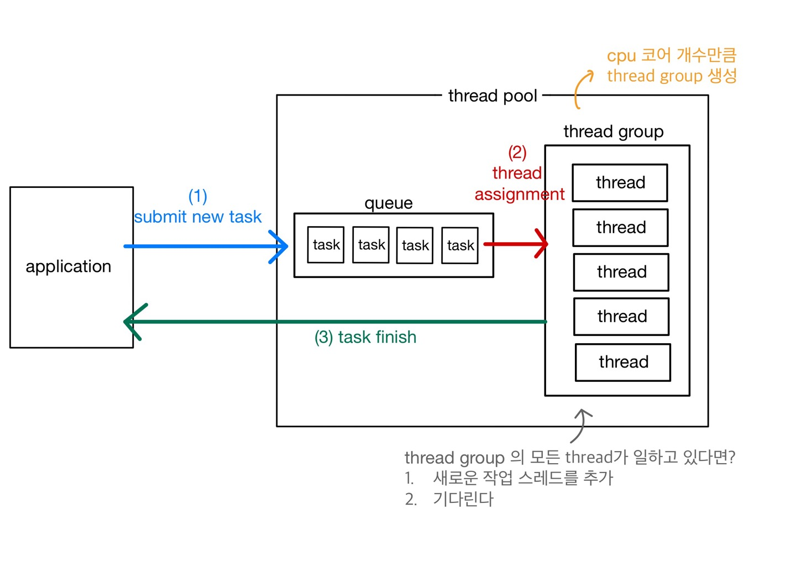

# 스레드 풀
- MySQL은 멀티스레드 프로그램
- 멀티스레드 프로그램은 스레드풀을 이용해서 스레드 갯수를 제한함 (스레드풀의 목적 = 서버의 자원 소모 최소화)
- MySQL Percona Server의 풀 플러그인은 선순위 후순위 큐를 통해 특정 트랜잭션이나 쿼리를 우선적으로 처리할 수 있는 기능 제공
- 무작정 스레드 풀을 설정한다고 해서 성능이 갑자기 좋아지지 않는다.
- 스케줄링 과정에서 오히려 빈번한 context switching 으로 인하여 쿼리 처리가 더 느려질 수 있기 때문이다.

> 적절한 스레드 수를 설정하면 프로세서 친화도(processor affinity)도 높이고, 불필요한 context switch를 줄여 오버헤드를 낮출 수 있다.

# 스레드 풀 과정

1. 클라이언트(어플리케이션)에서 사용자로부터 작업요청을 하고, 들어온 요청을 작업 큐에 넣음
2. 스레드 풀은 작업 큐에 들어온 task 일감을, 미리 생성해놓은 thread 에게 할당
3. 일을 다 처리한 thread들은 다시 클라이언트 (어플리케이션)에게 결과값을 리턴

# MySQL 에서 스레드 풀을 쓰려면?

Percona Server에서 제공하는 스레드 풀 기능을 사용. 스레드풀로 성능을 높이려면 세팅을 잘 해줘야함을 명심해야 한다.

- thread_pool_size 시스템 변수
    - 스레드그룹의 갯수를 조정한다.
    - 일반적으로 이 값을 CPU 코어 갯수와 맞추는 것이 CPU 프로세서 친화도를 높이는 데 좋다.
- thread_pool_oversubscribe
    - 한 개의 스레드 그룹 안에서 몇 개의 스레드까지 동시에 active 상태일 수 있게 할 것인지 정하는 변수 (디폴트 값 : 3 )
    - 이 변수값이 너무 크면 스케줄링해야 할 스레드가 많아져서 스레드풀이 비효율적으로 작동할 수도 있다.
- thread_pool_stall_limit
- thread_pool_max_threads
    - 전체 스레드 풀에 있는 스레드 갯수의 최대값
    - 스레드 총 갯수는 이 값을 절대 넘을 수 없다.

# Percona Server의 우선순위 큐

percona server의 스레드 풀 플러그인은 선순위 큐와 후순위 큐를 이용하여 특정 트랜잭션이나 쿼리를 우선적으로 처리할 수 있는 기능도 제공한다.