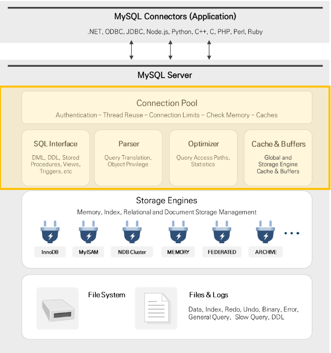

# MYSQL 엔진 구조

## Connection Pool Layer
 - Connection Pool은 MySQL Architecutre의 최상위 계층으로 Client의 Connection을 생성 및 관리하며 요청 Query를 처리

 1. 연결 처리
  - MySQL Server는 Client의 Connection 요청에 대해 Thread를 할당합니다. Client는 할당받은 Thread에서 Query를 수행
   (Thread는 Server에 의해 캐시 되므로 새로운 Connection에 대하여 항상 생성할 필요는 없음)
 2. 인증
  - MySQL Server는 Client가 연결될 때마다 Client의 호스트, 사용자 이름, 패스워드 등을 기반으로 인증을 수행
 3. 보안
  - MySQL Server에 Client가 성공적으로 연결되면 Server는 해당 Client가 특정 Query를 수행할 권한이 있는지 확인
 
## SQL Interface
 - MySQL은 Command를 수신하고 Client에게 결과를 전송하는 Interface로 ANSI SQL 표준을 준수하며, 대부분의 ANSI 호환 Database Server의 SQL을 Interface로 사용
 - SQL Interface 구성요소는 DML, DDL, Stored Procedures, Views, Triggers 등이 있음

## Parser
 - 사용자 요청 Query를 토큰(MySQL이 인식할 수 있는 최소 단위의 어휘나 기호)으로 분리, Tree 형태의 구조로 만들어 내는 작업을 의미, 이 과정에서 Query의 문법 오류 발견 시 사용자에게 오류 메시지를 전달

## Optimizer
 - 사용자의 요청 Query를 얼마나 낮은 비용으로 효율적으로 처리할지를 결정하는 역할을 수행. Query 재작성, 스캔 순서 조정 및 인덱스의 선택과 같은 작업을 수행

## Cache & Buffers
 - Data 및 인덱스에 대해 빠르게 Read/Write 하기 위한 목적으로 사용되는 메모리 공간. (MyISAM의 Key Cache나 InnoDB의 Buffer Pool과 같은 보조 저장소)

