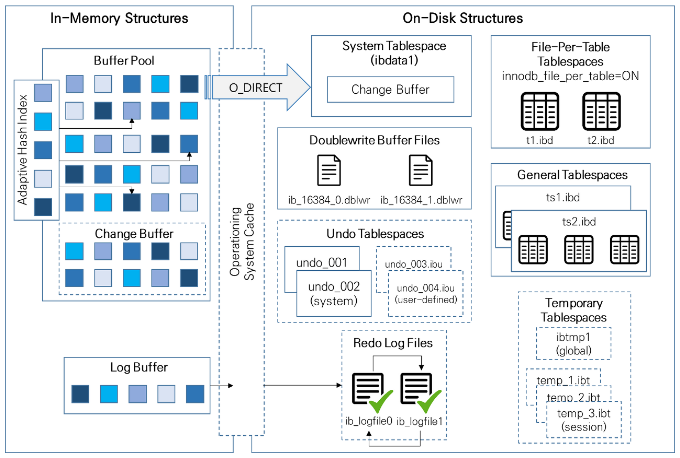

# InnoDB 스토리지엔진 
InnoDB 엔진은 MySQL 8.0의 기본 스토리지 엔진이며, 가장 보편적으로 많이 사용하는 스토리지 엔진. (Oracle과 가장 유사한 구조를 가지고 있음)

- InnoDB 엔진 사용 시 DML 작업은 ACID 모델을 따르며 Commit, Rollback 및 복구 기능을 갖춘 트랜잭션으로 Data를 보호
- InnoDB의 핵심 특징은 Buffer Pool의 존재. Oracle의 Buffer Cache와 마찬가지로 디스크 상의 Data 파일이나 인덱스 정보를 메모리에 캐시 해두기 위한 공간이며, 변경된 Data를 모아서 처리하기 때문에 디스크 I/O 횟수를 줄일 수 있음.
- PK(Primary Key)를 기반으로 쿼리를 최적화하도록 디스크에 Data를 정렬하여 저장하며, Clustered Index라는 Primary Key Index가 있어 PK 검색에 대한 I/O 를 최소화
- Row-Level Lock 및 MVCC를 이용하여 Multi User에게 동시성을 제공
- MySQL은 트랜잭션의 Commit과 Rollback 여부와 상관없이 변경 이전의 Data를 Undo 로그에 기록하여 격리 레벨에 따라 Lock을 사용하지 않고 일관되게 Data 조회가 가능
- 데이터 무결성을 보장하기 위해 FK(Foreign Key)를 지원합니다. 관련 Data를 다른 테이블로 분리할 때 참조 무결성을 위한 FK 설정이 가능.
- 자동으로 Dead Lock을 감지하여 변경된 레코드가 가장 적은 트랜잭션을 Rollback하여 자동으로 데드락 해제
