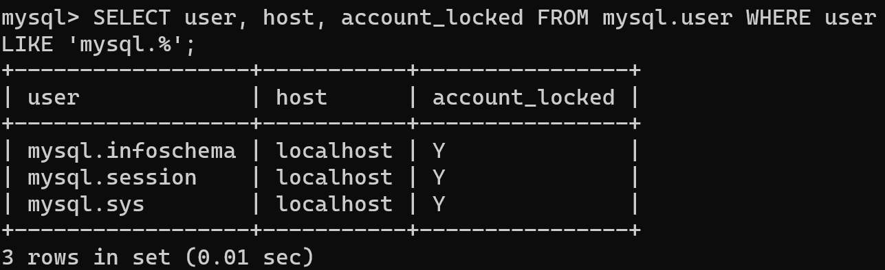
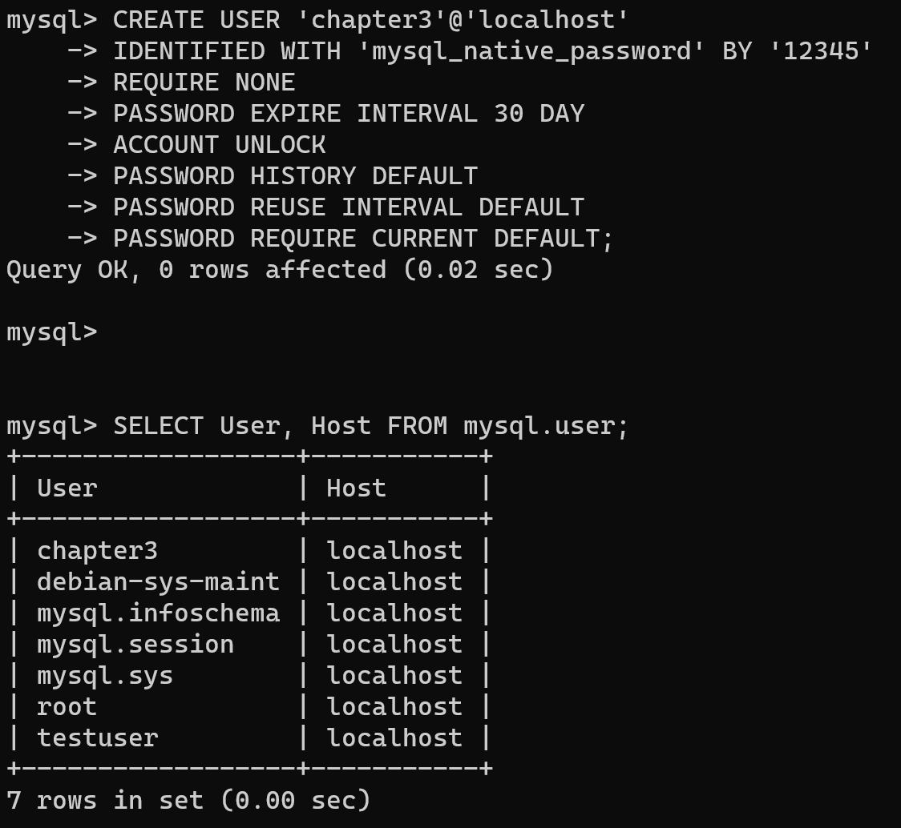

# 1. 일반 계정과 시스템 계정

`SYSTEM_USER` 권한 여부에 따라 아래와 같이 두 가지로 구분된다.

- 시스템 계정 (system account - for 서버 관리자, DBA)
    - 계정 관리 (계정 생성/삭제, 권한 부여/제거)
    - 다른 세션 (Connection) 또는 그 세션에서 실행 중인 쿼리 강제 종료
    - 스토어드 프로그램 생성 시 DFFINER를 타 사용자로 설정
- 일반 계정 (regular account - for 개발자)
    - 일반 사용자를 위한 계정으로, 일반 계정은 시스템 계정을 관리할 수 없다.
    - 데이터베이스 서버 관리와 관련된 작업은 수행할 수 없다.

MySQL 서버에는 `‘root’@’localhost’를 제외한 세 개의 계정`이 내장되어 있다.

세 개의 계정은 처음부터 잠겨있는 상태 (account_locked 칼럼) 이므로 보안을 걱정하지 않아도 된다.



- mysql.infoschema : information_schema에 정의된 뷰의 DEFINER로 사용되는 계정
- mysql.session : MySQL 플러그인이 서버로 접근할 때 사용되는 계정
- mysql.sys : sys스키마의 객체(뷰나 함수, 프로시저)들의 DEFINER로 사용되는 계정

# 2. 계정 생성하기
MySQL 8.0 버전부터는 계정의 생성 (CREATE USER)과 권한 부여(GRANT)를 구분하고 있음

1. 계정 생성하기 → CREATE USER 명령으로
    - 계정 인증 방식을 내가 커스텀하려면 IDENTIFIED WITH
    - 계정 인증 방식을 MySQL 서버 디폴트값으로 하려면 IDENTIFIED BY
    - 12345를 비밀번호로 하는 chapter3 계정 생성함
        
        ```sql
        CREATE USER 'chapter3'@'localhost'
        IDENTIFIED WITH 'mysql_native_password' BY '12345'
        REQUIRE NONE
        PASSWORD EXPIRE INTERVAL 30 DAY
        ACCOUNT UNLOCK
        PASSWORD HISTORY DEFAULT
        PASSWORD REUSE INTERVAL DEFAULT
        PASSWORD REQUIRE CURRENT DEFAULT;
        ```
        
        

    <details>
    <summary>옵션 살펴보기</summary>
    <div markdown = "1">
    <h3> (1) IDENTIFIED WITH </h3>
    MySQL 서버에서는 다양한 인증 방식을 플러그인 형태로 제공하며, 다음 4가지 방식이 가장 대표적이다. → Native Pluggable Authentication, Caching SHA-2 Pluggable Authentication, PAM Pluggable Authentication, LDAP Pluggable Authentication
    <h3>(2) REQUIRE</h3>
    암호화 채널 사용 여부
    <h3>(3) PASSWORD EXPIRE</h3>
    비밀번호 유효 기간 설정
    <h3>(4) ACCOUNT UNLOCK</h3>
    계정 잠금 여부
    <h3>(5) PASSWORD HISTORY</h3>
    비밀번호 재탕 할 건지 안할건지    
    <h3>(6) PASSWORD REUSE INTERVAL</h3>
    한 번 쓴 비번 재사용 금지 기간
    <h3>(7) PASSWORD REQUIRE</h3>
    비번 만료되어 새 비번으로 변경할 때, 현재 비번을 필요로 할 지 말 지 
    </div>
    </detais>
2. 권한 부여 -> [GRANT 명령으로](4_권한(Privilege).md)
   
   