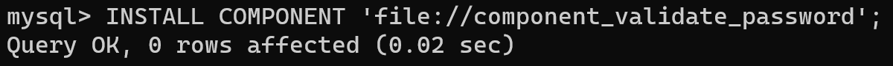
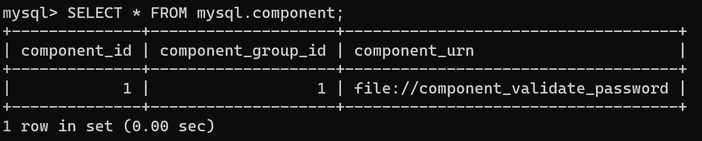
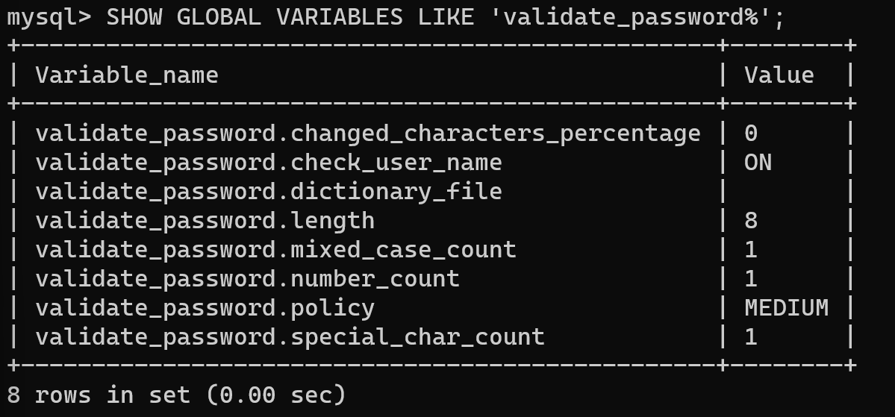
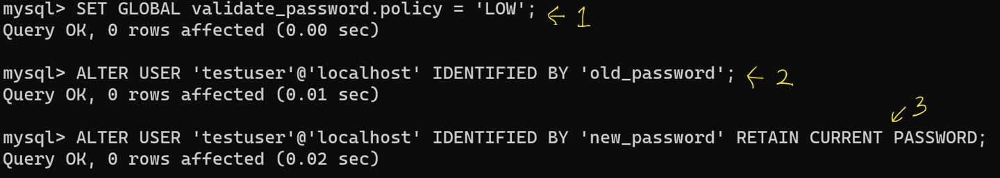
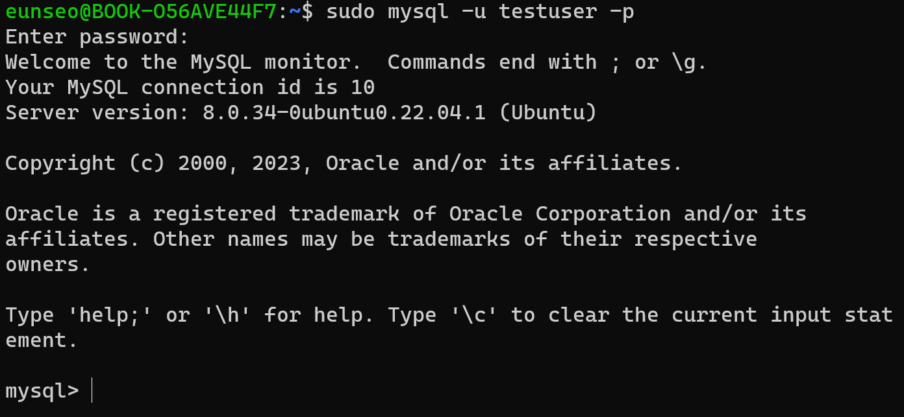
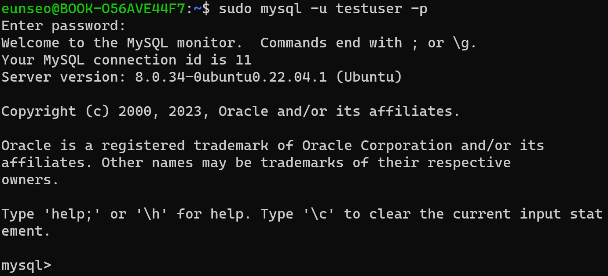
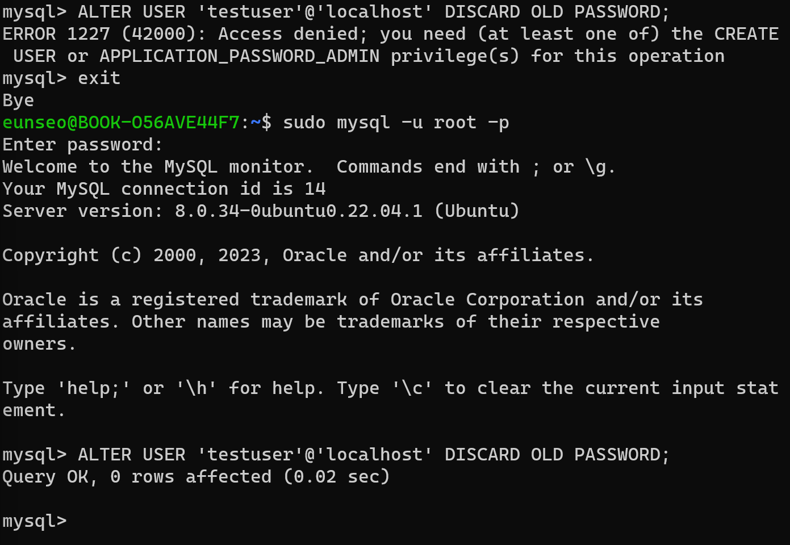
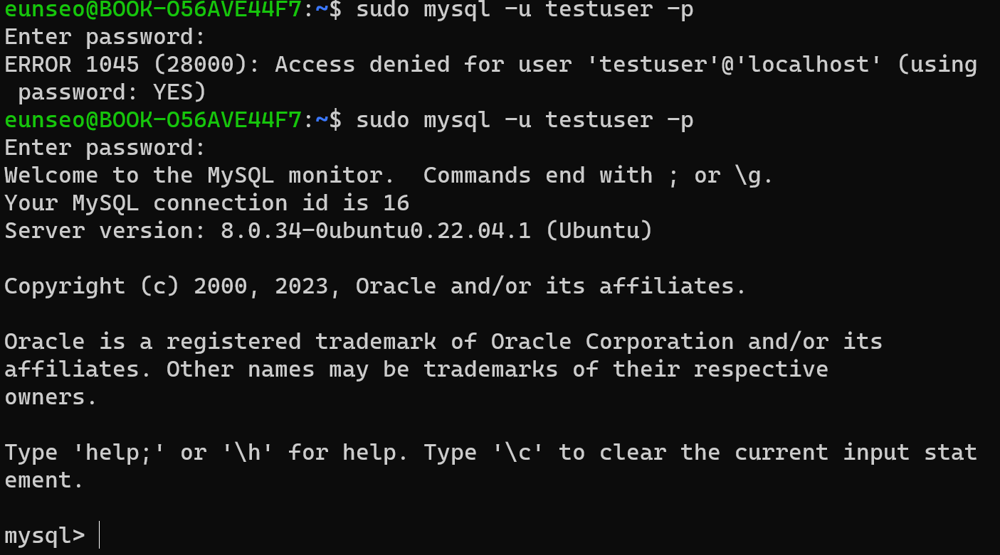

# 1. 고수준 비밀번호

## validate_password 컴포넌트
1.  validate_password 컴포넌트
    - MySQL 서버에서 비밀번호 유효성 체크 (ex. 쉽게 유추 가능한 단어가 사용됐나? 사용하면 안 되는 단어가 들어있나? 등) 를 위한 컴포넌트
2. 설치 방법 & 설치 확인
    1. validate_password 컴포넌트 설치하기
        
        mysql에 접속하여 아래와같이 코드를 작성한다.
        
        ```sql
        INSTALL COMPONENT 'file://component_validate_password';
        ```
        
        
        
    2. 설치된 컴포넌트 확인하기
        
        ```sql
        SELECT * FROM mysql.component;
        ```
        
        
        
    3. validate_password 컴포넌트에서 제공하는 시스템 변수 확인하기
        
        ```sql
        SHOW GLOBAL VARIABLES LIKE 'validate_password%';
        ```
        
        
        
        <details>
        <summary>시스템 변수 설명</summary>
        <div markdown = "1">
            1. validate_password.dictionary_file : 시스템 변수에 설정된 사전 파일에 명시된 단어를 포함하고 있는지 검증

            2.  validate_password.length : 시스템 변수에 설정된 길이 이상의 비번이 사용됐는지 검증
                
            3. validate_password.mixed_case_count
            validate_password.number_count
            validate_password.special_char_count : 숫자, 대소문자, 특수문자 검증 (설정된 글자 수 이상을 포함하고 있는지)
        </div>
        </details>
        
                
## 비밀번호 정책
비밀번호 정책은 validate_password 컴포넌트의 police 시스템변수에서 담당함. 크게 세 가지 중 하나로 선택할 수 있으며 기본값은 MEDIUM임

    LOW : 비밀번호의 길이만 검증
    MEDIUM : 비밀번호의 길이, 숫자와 대소문자, 특수문자의 배합 검증
    STRONG : MEDIUM 레벨의 검증 + 금칙어 포함 여부까지 검증

### 금칙어 적용해보기
금칙어는 validate_password.dictionary_file 시스템 변수에서 금칙어들이 저장된 사전 파일을 등록하면 된다.

1. 금지 단어 파일을 만든다.
    prohibitive_word.data 형태로 바탕화면에 저장해둠
            
            
            
2. 금칙어 파일을 myql 서버에 등록한다.
        
    ```sql
        mysql > SET GLOBAL validate_password.dictionary_file = 'prohibitive_word.data';
    ```    
        
        
3. validate_password.policy 시스템 변수를 ‘STRONG’으로 변경한다.
        
    ```sql
        mysql > SET GLOBAL validate_password.policy = 'STRONG';
    ```
        
        
        
4. 계정을 생성하고 테스트해본다.
    1. 왜 되는거지?….
        
    
        
    

### 계정 삭제하기    
1. 현재 등록된 계정을 확인하자
- 현재 생성된 DB의 사용자 계정들을 확인할 수 있다.
                
    ```sql
    use mysql;
    select host, user from user;
    ```
    
    
                
2. 삭제하고자 하는 계정을 삭제하자
            
    
    
    ```sql
    mysql > DROP USER 'wrongPW'@'localhost';
    //DROP USER [USER명]@[SERVER명];
    ```
            

# 2. 이중 비밀번호(Dual Password)

기존에는 서비스를 모두 멈추지 않고서는 비밀번호 변경이 불가능했음

⇒ MySQL 8.0 버전부터는 계정의 비밀번호로 2개의 값을 동시에 사용할 수 있는 `이중 비밀번호` 기능이 추가됨 

- 프라이머리 (Primary) : 최근 설정한 비밀번호
- 세컨더리 (Secondary) : 이전에 설정한 비밀번호

⚡여기에서 이중이란 2개의 비번을 모두 입력해야 로그인된다는 것이 아니라, <u>설정한 두 개의 비밀번호 중에서 하나만이라도 입력을 하면 로그인이 된다</u>는 것을 의미한다 ! 

## 이중 비밀번호 생성해보기
2장에서 0213 비밀번호를 가진 testuser 계정을 생성했는데 이 계정을 이용하여 이중 비밀번호를 생성해보자.

1. (비밀번호 간단하게 사용하기 위해서) 일단 보안을 낮추자.
    
    ```sql
    mysql> SET GLOBAL validate_password.policy = 'LOW';
    ```
    
2. 비밀번호를 ‘old_password’로 설정하자.
    ```sql
    mysql > ALTER USER 'testuser'@'localhost' IDENTIFIED BY 'old_password';
    ```
    - ALTER : 변경이 발생할 때 사용하는 명령어
    
3. 비밀번호를 ‘new_password’로 변경하면서 기존 비밀번호를 세컨더리 비밀번호로 설정함
    ```sql
    ALTER USER 'testuser'@'localhost' IDENTIFIED BY 'new_password' RETAIN CURRENT PASSWORD;
    ```

- 전체 과정 (1~3) 결과

    
## 이중 비밀번호를 이용하여 로그인해보기
- 세컨더리(old_password)로 로그인 성공


- 프라이머리(new_password)로 로그인 성공함


## 이중 비밀번호 삭제하기
```sql
ALTER USER 'testuser'@'localhost' DISCARD OLD PASSWORD;
```
세컨더리 비밀번호를 꼭 삭제해야 하는 것은 아니지만 계정을 보안을 위해 세컨더리 비밀번호(old_password)는 삭제하는게 좋다.

기존 비밀번호 (old_password)로는 로그인이 불가하며 **새로운 비밀번호(new_password)로만** 로그인할 수 있다.

<details>
<summary> 참고 </summary>
<div markdown = "1">
<div class="colorscripter-code" style="color:#010101;font-family:Consolas, 'Liberation Mono', Menlo, Courier, monospace !important; position:relative !important;overflow:auto"><table class="colorscripter-code-table" style="margin:0;padding:0;border:none;background-color:#fafafa;border-radius:4px;" cellspacing="0" cellpadding="0"><tr><td style="padding:6px;border-right:2px solid #e5e5e5"><div style="margin:0;padding:0;word-break:normal;text-align:right;color:#666;font-family:Consolas, 'Liberation Mono', Menlo, Courier, monospace !important;line-height:130%"><div style="line-height:130%">1</div></div></td><td style="padding:6px 0;text-align:left"><div style="margin:0;padding:0;color:#010101;font-family:Consolas, 'Liberation Mono', Menlo, Courier, monospace !important;line-height:130%"><div style="padding:0 6px; white-space:pre; line-height:130%">&nbsp;<span style="color:#ff3399">ALTER</span>&nbsp;USER&nbsp;<span style="color:#7DA123">'testuser'</span>@<span style="color:#7DA123">'localhost'</span>&nbsp;DISCARD&nbsp;OLD&nbsp;PASSWORD;</div></div></td><td style="vertical-align:bottom;padding:0 2px 4px 0"><a href="http://colorscripter.com/info#e" target="_blank" style="text-decoration:none;color:white"><span style="font-size:9px;word-break:normal;background-color:#e5e5e5;color:white;border-radius:10px;padding:1px">cs</span></a></td></tr></table></div> 

처음에는 testuser 계정으로 mysql 에 접속하여 실행했는데, 에러 메세지가 나왔음 (아마 testuser는 alter 할 권한이 없었던 듯 하다). root 로 접속하여 실행했더니 old_password가 잘 지워짐! 
</div>
</details>


- old password 삭제하기    


- old password 삭제 후 로그인해보기



testuser 계정의 old_password로는 로그인 안 되고 new_password로는 로그인 잘 됨