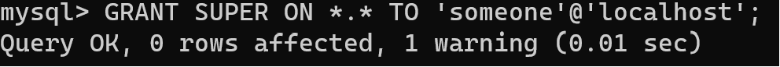
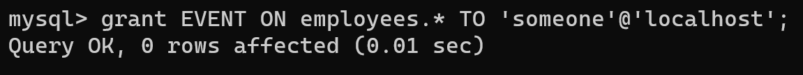
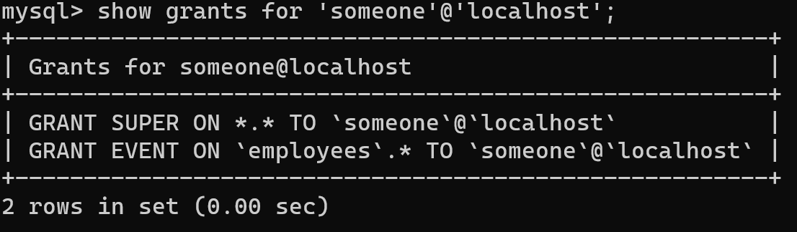

# 글로벌 권한과 객체 권한
MySQL 5.7 버전까지는 글로벌(Global) 권한과 객체 단위의 권한으로 구분되어 있었음.

- 글로벌 권한
    - **데이터베이스나 테이블 이외의 객체**에 적용되는 권한
    - GRANT 명령에서 특정 객체를 명시하지 말아야 한다.
- 객체 권한
    - **데이터베이스나 테이블**을 제어하는데 필요한 권한
    - 객체권한은 GRANT 명령으로 권한을 부여할 때 반드시 특정 객체를 명시해야 한다.

---
# 추가된 동적 권한
MySQL 8.0 버전부터는 5.7버전에서 사용하던 버전을 **정적 권한으로 분류**되며 **동적 권한이 추가**되었음.

- 동적 권한
    - MySQL 서버가 시작되면서 **컴포넌트나 플러그인이 설치되면서 생성, 등록되는** 권한

MySQL 5.7에서는 SUPER 라는 권한이 데이터베이스 관리에서 꼭 필요한 권한이었는데 8.0에서는 SUPER 권한을 쪼개서 동적 권한으로 분산함  
⇒ 세밀하게 나누어져있으니, 백업 관리자와 복제 관리자 개별로 꼭 필요한 권한만 부여할 수 있게 됨 
⇒ 이전 버전에 비해 세세한 권한 관리가 가능해짐

---

# 권한 부여하기

사용자에 따라서 접근할 수 있는 DB데이터와 사용할 수 있는 기능이 제한되어 있다. 권한을 부여할 때는 GRANT 명령을 사용한다.

## 1. 계정 생성하기


```sql
create user 'someone'@'localhost' identified by '12345678';
```

## 2. 접근 권한 할당하기

### (1) 글로벌 권한
```sql
GRANT SUPER ON '*' TO 'user'@'host';
```

* 글로벌 권한 부여 시 GRANT 명령어의 ON 절에는 항상 '*' (= 서버 전체) 사용
    
### (2) 특정 DB에 특정 권한 부여하기
```sql
grant [할당권한] on [데이터베이스명.테이블명].* to ‘[계정 명]’@’[접속 IP 주소]’ ;
```

* 특정 db에 대해서만 권한을 부여하거나 서버에 존재하는 모든 DB에 권한을 부여할 수 있음

### (3) 권한 조회하기
    
```sql
show grants for ‘[계정명]’@’[접속ip주소]’
```
    

    
* grant usage on *.* to 계정명@접속주소     
-> 아무런 권한이 없는 계정을 말함 (이 계정이 특정 권한을 나중에 승인할 것이라는 가정을 함)
