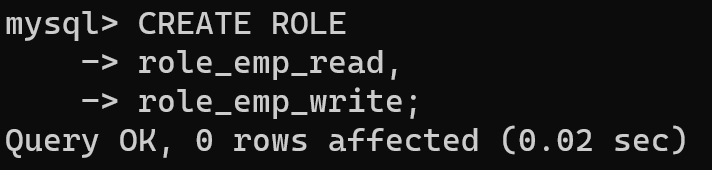
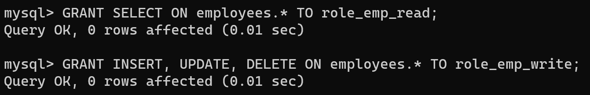
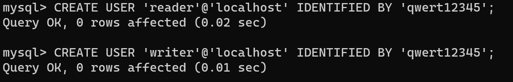
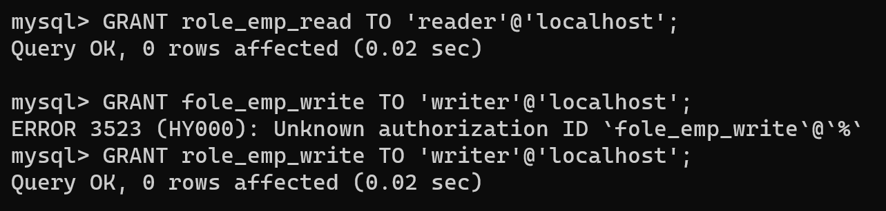
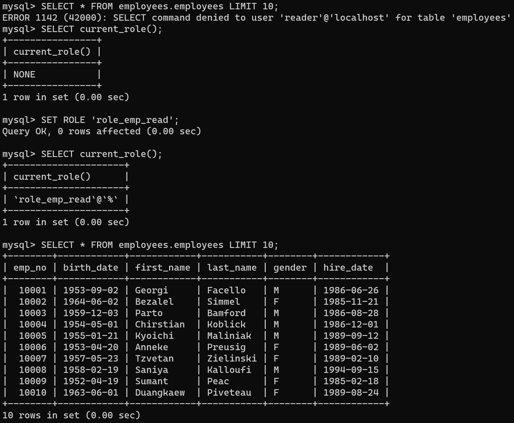
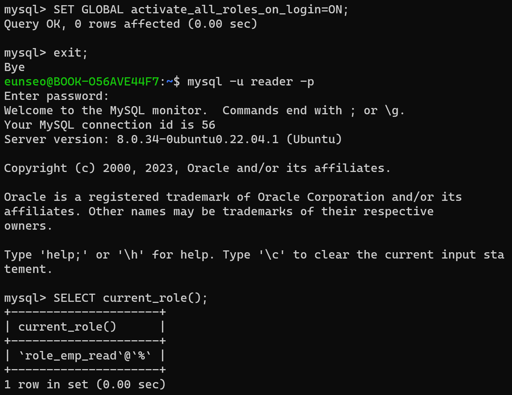
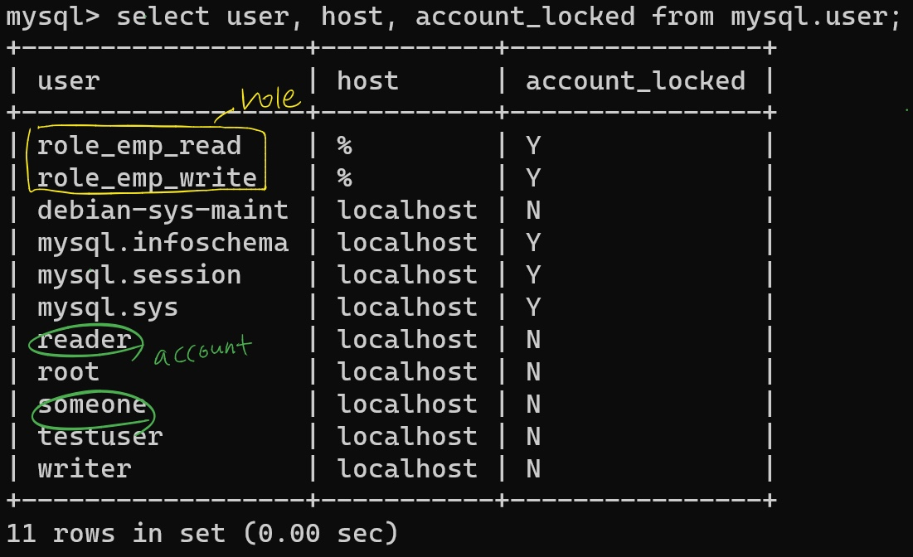

# 역할
MySQL 8.0 버전부터 권한을 묶어 역할(Role)을 사용할 수 있음

MySQL 서버 내부에서 역할과 계정은 똑같은 모습을 하고 있음 (동일한 객체로 취급함)

 왜 CREATE ROLE (역할 생성) 명령과 CREATE USER (계정 생성) 명령을 구분해서 지원할까? => DB 관리 직무를 분리하여 보안을 강화하는 용도

## ✏️ 사용예시
1.  `CREATE ROLE`로 역할을 만든다.

2. `GRANT` 명령으로 실질적인 권한을 부여한다.

3. `CREATE USER` 명령으로 계정을 생성한다.

* 계정에 아직 역할을 부여하지 않았음으로 아무런 쿼리도 실행 불가능
4. `GRANT` 명령으로 USER에게 ROLE을 통한 권한 부여

5. `SET ROLE` 명령을 실행해 역할을 **활성화**

* 이 상태로 계정 로그아웃 후 **다시 로그인하면** 역할이 활성화되지 않은 상태로 **초기화됨**
* 왜냐하면 MySQL 서버가 자동으로 활성화되지 않도록 설정되어 있기 때문임 (수동으로 활성화를 해야 함)
* `activate_all_roles_on_login` 변수 활성화를 통해 자동화 가능 (매번 `SET ROLE`로 역할 활성화하지 않도록 설정 가능)

## 계정과 역할

* MySQL에서 계정과 역할은 서로 구분하고 있진 않음 (서버 내부에서는 같은 객체로 취급)

* 계정(account)
    * 개별 사용자(= 데이터베이스 서버에 로그인할 수 있는 사용자)
* 역할(Role)
    * 권한을 그룹화하고 권한 관리를 단순화하는데 사용되는 권한 집합