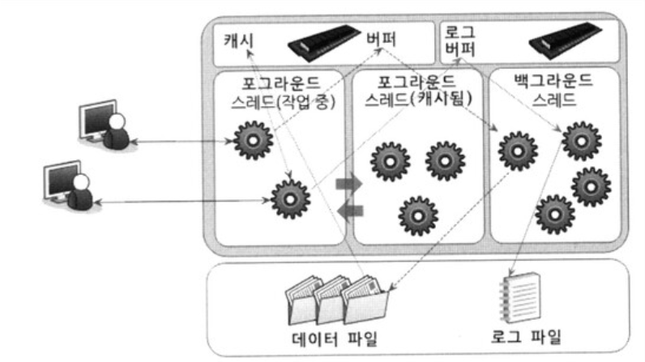
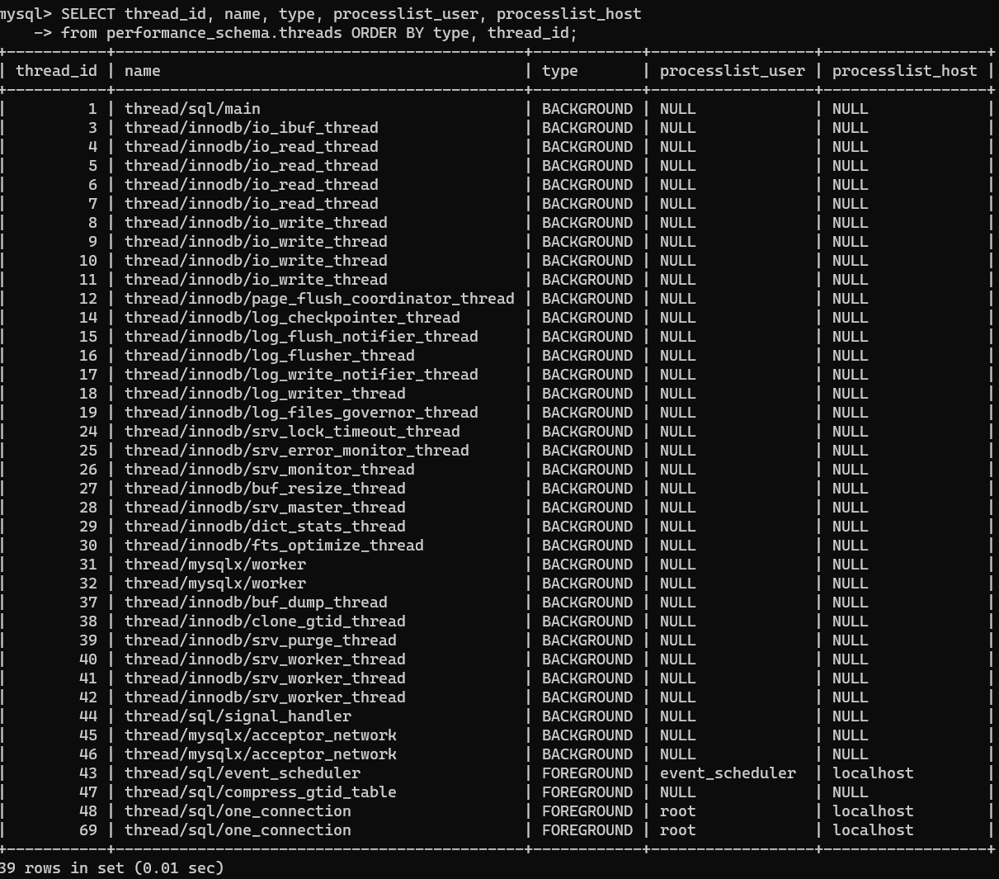

# MySQL 스레딩 구조


MySQL 서버는 프로세스 기반이 아니라 스레드 기반으로 동작함

MySQL 스레드 = foreground thread (포그라운드 스레드) + background thread (백그라운드 스레드)

- 아래 코드를 통해 MySQL 서버에서 실행중인 전체 스레드를 확인할 수 있다.

```sql
SELECT thread_id, name, type, processlist_user, processlist_host
from performance_schema.threads ORDER BY type, thread_id;
```



## 1. 포그라운드 스레드 (foreground thread)
- **실제 사용자(클라이언트 사용자)가 요청한 쿼리문을 처리하는 스레드**
        
- MySQL 서버에 접속된 사용자(클라이언트)의 수만큼 존재함
        
- 사용자가 작업을 마치고 커넥션을 종료하면, 해당 스레드는 스레드 캐시(thread pool)로 되돌아간다. thread_cache_size에 설정된 개수만큼 이미 스레드 캐시에 대기중이면, 스레드 캐시에 넣지 않고 스레드를 종료시킴
        
    > 💡 스레드 캐시란? <p>
    > 일종의 connetion/thread pool 역할로, 이미 일정 개수 이상 대기중인 스레드가 있으면 넣지 않고 버려서 스레드 캐시는 일정 개수를 유지할 수 있도록 한다.
        
- 데이터를 가져올 때 1차적으로 MySQL 데이터 버퍼나 캐시를 검사하고, 없을 때만 디스크나 인덱스 파일로부터 데이터를 읽어오는 구조
## 2. 백그라운드 스레드 (background thread)
- `thread/sql/one_connection` 을 제외한 모든 41개의 스레드.
- 여러 스레드가 동시 백그라운드 작업을 병렬로 처리하여 이름이 중복되어 나타난다.
- 사용자의 요청을 처리하는 도중, 데이터의 쓰기 작업은 버퍼링되어 처리될 수 있지만, 데이터의 읽기 작업은 절대 지연될 수 없다.

- InnoDB에서는 많은 작업들이 백그라운드로 처리된다.
    - 인서트 버퍼를 병합하는 스레드
    - **로그를 디스크로 기록하는 스레드**
    - **InnoDB 버퍼 풀의 데이터를 디스크에 기록하는 스레드**
    - 데이터를 버퍼로 읽어 오는 스레드
    - 잠금이나 데드락을 모니터링하는 스레드
                
- InnoDB는 쓰기 작업을 버퍼링해서 일괄처리하는 기능이 탑재되어 있기 때문에, 데이터 변경(insert, update, delete) 작업 시 디스크로 완전히 저장될 때까지 기다리지 않아도 됨

- MyISAM은 포그라운드 스레드가 쓰기작업까지 함께 처리하도록 설계되어있어 쓰기 버퍼링 기능을 사용할 수 없다.