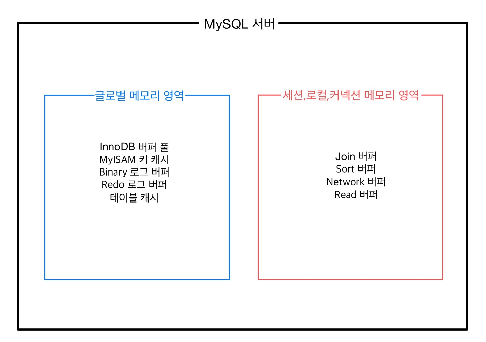

MySQL에서 사용되는 메모리 공간은 `글로벌 메모리 영역` 과 `로컬 메모리 영역` 으로 구분할 수 있다. (분류 기준 : 많은 스레드에 의해 공유되는가?)

각 영역의 메모리를 적절하게 설정해야 MySQL Server가 메모리 락 걸리는 현상을 방지할 수 있다.

# 1. 글로벌 메모리 영역

- 시스템변수가 영향을 미치는 곳이 서버 전체인 경우
- 모든 스레드로부터 공유되는 영역
- MySQL 서버를 시작하면 운영체제로부터 설정한 만큼의 **하나의 메모리 공간만 할당**받는다. (스레드의 수와 무관하게 하나의 메모리 공간만 할당된 영역)
    - 테이블 캐시, InnoDB 버퍼 풀, InnoDB 어댑티브 해시 인덱스, InnoDB 리두 로그 버퍼

# 로컬 메모리 영역 (클라이언트 메모리 영역, 세션 메모리 영역)

- 클라이언트 스레드가 쿼리를 처리하는 데 사용되는 메모리 영역
- 로컬 메모리 영역은 서버에 존재하는 클라이언트의 수만큼 생성됨
- 스레드별로 독립적으로 할당되며 절대 공유되어서는 안 된다.
- 쿼리의 용도별로 할당이 될 때도 있고 아예 할당되지 않을 때도 있다.
    - 정렬 버퍼, 조인 버퍼, 바이너리 로그 캐시, 네트워크 버퍼