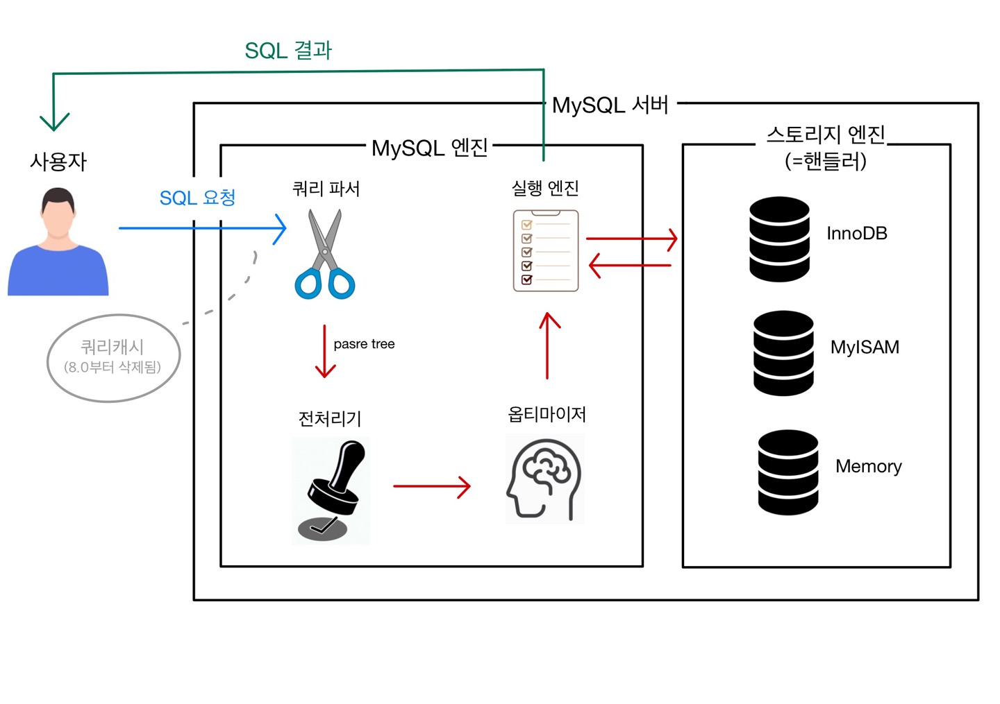

# 쿼리 실행 구조

## 0. 쿼리캐시
- MySQL 8.0으로 올라오면서 완전히 제거됨
    > 왜 지웠을까?
    
    쿼리 캐시의 원래 역할은 SQL 실행 결과를 메모리에 캐시하고, 동일 SQL 쿼리가 실행되면, 테이블 읽지 않고 즉시 결과를 반환
        
    → 테이블 데이터가 바뀌면 그와 관련된 결과도 캐시에서 삭제했음
    
    → `동시 처리 성능 저하 & 버그의 원인` 

## 1. 쿼리파서
- 쿼리 문장을 토큰으로 분리해 parse tree로 만든다.
- 쿼리 문장의 기본 문법 오류를 잡아냄

## 2. 전처리기

- 쿼리 문장에서 구조적 문제가 있는지 살펴본다. (테이블 이름, 칼럼 이름, 내장 함수 등이 있는지, 객체의 접근 권한 등 확인)

## 3. 옵티마이저

- SQL 실행을 **최적화**하여 실행계획을 수립
    - 규칙 기반 최적화
    - 비용 기반 최적화

## 4. 실행엔진

- 옵티마이저와 스토리지엔진(핸들러) 사이를 이어주는 역할
- 옵티마이저가 만든 실행 계획대로 스토리지 엔진을 호출하여 레코드를 읽고 씀

## 5. 핸들러 (스토리지 엔진)

- MySQL 엔진이 각 스토리지 엔진에게 데이터를 읽어오거나 저장하도록 명령하려면 반드시 핸들러를 통해야 한다!
- MySQL 실행 엔진의 요청에 따라 데이터를 디스크로 저장하고 디스크로부터 읽어옴 (by 핸들러 API)
- MyISAM 테이블을 조작하는 경우 핸들러가 MyISAM 스토리지 엔진이 되고, InnoDB 테이블을 조작하는 경우에는 핸들러가 InnoDB 스토리지 엔진이 된다